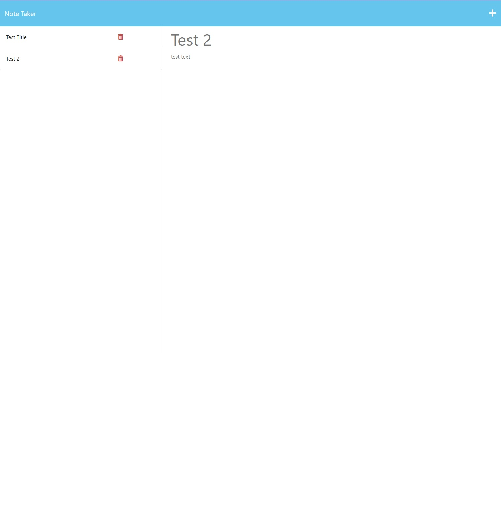

  
  
# expressjs_note.taker

  ## Table of Contents
  * [Description](#description)
  * [Usage](#usage)
  * [License](#license)
  * [Contribute](#contribute)
  * [Ask Me](#ask-me)

  ## Description
  This simple note taking application provides a tasklist like site where you can add and view tasks set.

  

  ## Usage
  Follow the heroku deployed link here

  ## License
  This project utilises the <a href="https://opensource.org/licenses/MIT" target="_blank">MIT license</a>

  ## Credits
  Credit to starter code https://github.com/coding-boot-camp/miniature-eureka

  ## Contribute
  No contributions required.

  ## Ask Me
  Find more of my projects at https://github.com/luanillustrates
  
  Email me at luanillustrates@gmail.com for any queries.
